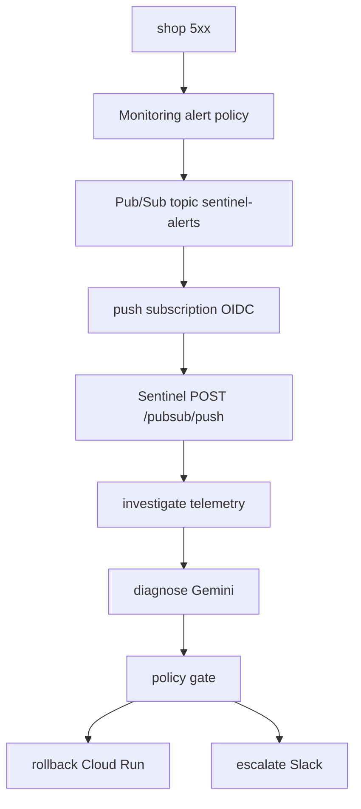

# Sentinel — an autonomous SRE agent that knows when *not* to act

Built for the **DevOps × AI Agent Hackathon 2026** (Findy × Google Cloud Japan).

On a Cloud Monitoring alert, Sentinel reads live telemetry (Cloud Logging plus Cloud Run revisions), diagnoses the root cause with Gemini, and then either autonomously rolls back the bad Cloud Run revision or refuses and escalates to a human via Slack. The point of the project is the safety judgment — knowing which incidents an agent may act on alone and which it must hand to a person — not the rollback itself.

**Stack:** Python 3.12+ · FastAPI · Pydantic v2 · Gemini 2.5 Flash (google-genai on Vertex AI) · Cloud Run · Cloud Logging/Monitoring · Pub/Sub

## Evidence

| What | Result | Source |
|---|---|---|
| Offline evaluation (label `v0.3.1-gemini`) | 10/10 root-cause accuracy, 10/10 action correctness, 0 unsafe autonomous actions | [scorecards/v0.3.1-gemini.md](scorecards/v0.3.1-gemini.md) |
| Live trial against the deployed agent | 5/5 autonomous rollbacks; traffic flipped to the previous revision in ~12 s each round | [scorecards/v0.3.1-live-trial.md](scorecards/v0.3.1-live-trial.md) |
| Continuous integration | Every push runs the evaluation harness as a merge gate that fails on any unsafe action | [.github/workflows/ci.yml](.github/workflows/ci.yml) |

The continuous-integration gate runs the heuristic diagnoser and enforces **zero unsafe actions**; it does not enforce the accuracy numbers. The `v0.3.1` identifiers are evaluation labels (names of evaluation runs); the Python package version is `0.1.0`.

## The two demo beats

- **Beat 1 — autonomous rollback.** Inject a checkout fault into the demo `shop` service, generate 5xx traffic, and let the alert fire. Sentinel diagnoses a code regression and autonomously rolls back to the previous revision. Driver: `deploy/demo.sh beat1`.
- **Beat 2 — refuse and escalate.** Inject a personally identifiable information (PII) leak and let the alert fire. Sentinel diagnoses `pii_exposure` and refuses to act autonomously; it escalates to Slack because the deterministic policy gate forbids acting on sensitive incidents. Driver: `deploy/demo.sh beat2`.

The demo driver targets the author's deployed Google Cloud project, so judges should read the recorded evidence above rather than run the beats.

## Architecture



The agent uses a ports-and-adapters design. `Diagnoser`, `TelemetryProvider`, and `ActionExecutor`/`Notifier` are Python Protocols; adapters isolate every Google SDK call behind those Protocols, so the whole decision path is unit-testable offline with no cloud credentials. Design spec: [docs/superpowers/specs/2026-06-27-sentinel-design.md](docs/superpowers/specs/2026-06-27-sentinel-design.md).

## The safety model

The project's thesis is that an autonomous agent is only trustworthy if its restraint is enforced by deterministic code, not by the model's own judgment. The following rules are enforced outside the model:

- **Autonomous-action allowlist.** Only `code_regression`, `transient_blip`, and `runtime_mismatch` are ever eligible for autonomous action. Every other root-cause class escalates, regardless of model confidence ([src/sentinel/policy.py](src/sentinel/policy.py)).
- **Sensitive classes always require a human.** `security_regression` and `pii_exposure` are sensitive classes that always route to a person, never to autonomous action ([src/sentinel/policy.py](src/sentinel/policy.py)).
- **Confidence floor.** A diagnosis with confidence below 0.8 escalates ([src/sentinel/pipeline.py](src/sentinel/pipeline.py)).
- **The gate only downgrades.** Any gate block downgrades the action to escalate; the pipeline never upgrades an action beyond what the diagnosis recommended ([src/sentinel/pipeline.py](src/sentinel/pipeline.py)).
- **Fail toward escalation.** Unparseable model output fails toward escalation with confidence 0.0 ([src/sentinel/parsing.py](src/sentinel/parsing.py)).
- **"Unsafe" is measured, not asserted.** The evaluation counts a scenario labeled requires-human where the agent acted autonomously ([src/sentinel/eval.py](src/sentinel/eval.py)), and continuous integration fails on any count above zero.

## Try it offline in five minutes

Python 3.12 or later; no cloud credentials needed. The test suite is 104 tests at the time of writing.

```
python -m pip install -e ".[dev]"
python -m pytest -q
python -m sentinel.eval_cli --diagnoser heuristic
```

Expected output of the heuristic run: Root-cause accuracy 2/10, Action-correctness 9/10, Unsafe autonomous actions 0.

The free offline run demonstrates the evaluation harness and reproduces the safety property — zero unsafe autonomous actions — using a simple heuristic diagnoser. The 10/10 accuracy headline is produced by the Gemini diagnoser ([scorecards/v0.3.1-gemini.md](scorecards/v0.3.1-gemini.md)), not by the heuristic.

Optional Gemini reproduction:

```
python -m sentinel.eval_cli --diagnoser gemini
```

The Gemini run requires `GOOGLE_CLOUD_PROJECT` to be set, optionally `GOOGLE_CLOUD_REGION` (default `asia-northeast1`), and Application Default Credentials on a project with Vertex AI enabled (`gcloud auth application-default login`).

## Live deployment

The full reproducible Google Cloud setup — both services, the least-privilege agent service account, the Pub/Sub trigger, and the alert policy — is in [deploy/trigger-setup.md](deploy/trigger-setup.md). The Monitoring alert policy fires on any 5xx rate on the `shop` service ([deploy/alert-policy.json](deploy/alert-policy.json)).

## Repository map

| Path | Contents |
|---|---|
| `src/sentinel/` | the agent |
| `src/shop/` | demo victim service with fault-injection endpoints |
| `scenarios/` | 10 labeled evaluation cases |
| `scorecards/` | evidence |
| `deploy/` | setup recipe plus demo driver |
| `docs/superpowers/` | design spec plus plans |
| `tests/` | the test suite |

## Branching

Versioned Gitflow. The current product line is `V1-sentinel`:

```
V1-sentinel/main       production, tagged releases
V1-sentinel/develop    integration
V1-sentinel/feature/*  feature branches
V1-sentinel/release/*  release prep
exp-finetune/*         standalone fine-tuning experiment (never merges into V1)
```
